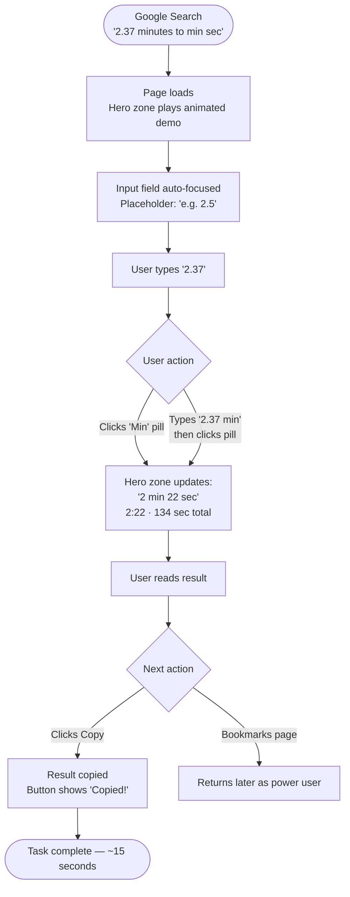
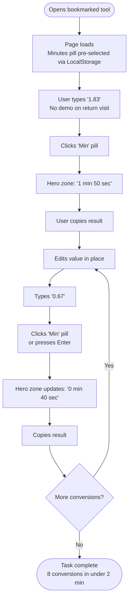
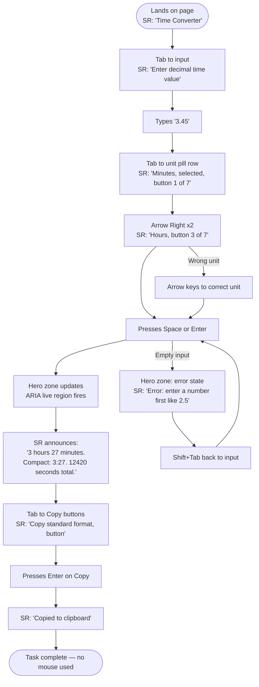

# UX Design Specification timeconversion-web

**Author:** Yo
**Date:** 2026-02-17

---

## Executive Summary

### Project Vision

A universal decimal-to-readable time converter solving the gap that existing web tools don't address: when a user searches "2.5 minutes in minutes and seconds," every other converter echoes the decimal back unchanged. This tool gives "2 min 30 sec" — instantly, for all 7 time units (seconds through years). The tool is discoverable via Google, usable in 15 seconds, and built as a static HTML file with no backend or framework dependency.

### Target Users

**Primary — The Task-Focused Searcher (Alex persona)**
- Arrives via Google search query ("2.37 minutes to minutes seconds")
- Needs the answer immediately — no onboarding, no friction
- Likely a developer, analyst, or anyone working with APIs, logs, or spreadsheets
- Returns repeatedly if the tool is fast and remembers their context
- Uses keyboard heavily; values Enter-to-convert and copy-to-clipboard

**Secondary — The Accessibility User (Jordan persona)**
- Relies on screen reader and keyboard-only navigation
- Needs descriptive ARIA labels, live region result announcements, and logical tab order
- WCAG 2.1 AA compliance is not optional — it's a first-class requirement

**Tertiary — The Power User**
- Rapid-fire batch conversions (8+ per session)
- Values: unit persistence, instant re-convert on unit change, keyboard shortcuts (V1.0)

### Key Design Challenges

1. **Unit selection without friction** — The tool cannot assume the unit, yet a mandatory dropdown adds cognitive weight. The hybrid input (parse natural language OR use selector buttons) must feel seamless — users should never feel like they're filling out a form.

2. **First-time comprehension in under 2 seconds** — No instructions. The animated demo on page load ("2.5 min" types itself → converts → "Try it yourself!") and example placeholder text must be the entire onboarding experience. If a user has to read anything, we've failed.

3. **Output legibility across wildly different scales** — "0.0003 years" and "1,825,000 seconds" need completely different precision and breakdown logic. The display must feel intelligent and contextually appropriate, not mechanical.

### Design Opportunities

1. **Zero-friction repeat use** — Remembering the last unit selection + instant re-convert on unit change creates a near-telepathic experience for power users. This is a meaningful differentiator — no other converter tool does this combination well.

2. **Result as hero** — Users arrive with one goal. Making the result display unusually large and prominent (vs. the typical converter grid of equal-weight fields) creates immediate satisfaction and signals this tool "gets it."

3. **Keyboard-first as a feature, not accommodation** — Developers are the most likely repeat users and bookmarkers. A complete type → Tab → Enter → copy keyboard flow makes this the fastest converter for that audience — a natural acquisition channel for word-of-mouth.

---

## Core User Experience

### Defining Experience

The core loop: type a decimal value, confirm a unit, press Enter, read the result. This four-beat interaction is the entire product. Every design decision exists to make it faster, clearer, and more satisfying.

### Platform Strategy

Web-first static HTML — works offline as a downloaded file, no server or framework required. Desktop users expect keyboard-driven flow (type → Tab → Enter → copy). Mobile users expect large touch targets and a single-column layout. Both experiences share the same HTML file with CSS adapting the layout.

### Effortless Interactions

- Last-used unit persists across sessions via LocalStorage (implemented in V1.0; MVP defaults to "minutes")
- Changing unit after conversion instantly re-converts without re-typing
- Enter key triggers conversion — the universal developer expectation
- One-click copy per output format — no text selection required
- Decimal comma accepted alongside period — international input, zero friction

### Critical Success Moments

- Page load animated demo: user understands the tool in under 2 seconds, no reading required
- First conversion result appears: instant, accurate, legibly broken down — the "aha" moment
- Unit switch → instant re-convert: power user delight, no re-typing
- Screen reader announces result: accessibility user completes journey independently
- Copy → paste into document: task done, tool delivered on its promise

### Experience Principles

1. **Result is the hero** — the converted output is the most prominent element; everything else is support
2. **One step shorter** — every interaction should require one fewer click or keystroke than a competitor
3. **Feels like it already knew** — state persistence, smart defaults, and instant re-convert create the illusion of intelligence
4. **Accessible first** — keyboard and screen reader flows are designed from the start, not bolted on at the end

---

## Desired Emotional Response

### Primary Emotional Goals

Primary: **Efficiency satisfaction** — "That was fast. Exactly what I needed."
This is a mid-task tool for people trying to get something done. The emotional target is the pleasure of a sharp, well-made instrument: it works, it's trustworthy, it respects your time.

Supporting: Confidence (the result looks right), Relief (finally a converter that actually works), Ownership (the tool bends to the user, not the other way around).

### Emotional Journey Mapping

- **Landing:** Immediate clarity — user sees exactly what to do without reading anything
- **Conversion:** Focused and in control — no ambiguity about units or what will happen
- **Result:** Satisfied and confident — the breakdown makes the answer feel verifiable, not arbitrary
- **Error:** Helped, not blamed — error messages guide rather than reject
- **Return visit:** Comfortable and familiar — persistent state, predictable layout, zero re-learning

### Micro-Emotions

- Confidence over skepticism: the full breakdown (not just the answer) makes the result feel provable
- Accomplishment over frustration: every error message is a helpful nudge, never a wall
- Delight at exactly two moments: page-load animation and instant re-convert; everywhere else is invisible
- Trust over novelty: visual restraint and accuracy outweigh clever interactions

### Design Implications

- Show the full result breakdown → builds confidence, removes doubt about accuracy
- Large, prominent result typography → reinforces that the result is the hero
- Enter-to-convert, one-click copy, no page reload → delivers efficiency satisfaction
- Friendly error copy with examples → converts frustration into guidance
- Unit persistence and consistent layout → creates familiarity on return visits
- Resist adding animations beyond page-load demo and re-convert → preserves trust through restraint

### Emotional Design Principles

1. **Respect the user's task** — they came to get something done; don't make them feel like they're using the tool, make them feel like the tool is serving them
2. **Earn confidence, don't assume it** — show the math breakdown so users can verify, not just accept
3. **Delight through absence of friction** — the most delightful moment is when nothing goes wrong
4. **Errors are guidance, not gates** — every error state is an opportunity to help the user succeed

---

## UX Pattern Analysis & Inspiration

### Inspiring Products Analysis

**Google inline unit converter** — Zero chrome, result is the entire interface. No navigation to find, no page to orient to. Lesson: the fastest path to a result is having nothing else on the screen.

**Wolfram Alpha** — Shows the math, not just the answer. Transparency builds instant trust; users never wonder "is that right?" Lesson: the breakdown is a feature, not clutter.

**time.is** — Single-purpose, ruthlessly focused. Does one thing per page, does it perfectly. Lesson: scoping creates authority; a tool that does one thing perfectly feels more trustworthy than one that does many things adequately.

**Native calculator apps (iOS/macOS)** — Keyboard is the primary interface; touch is secondary. Enter produces an instant result. Lesson: design the keyboard flow first; everything else follows.

### Transferable UX Patterns

**Adopt directly:**
- Input field auto-focused on page load — user types immediately, no click required
- Enter key triggers conversion — universal expectation, no learning required
- Result larger than input — inverts the typical form hierarchy to reflect actual importance
- Show the full breakdown alongside the summary — Wolfram Alpha's trust-building transparency

**Adapt for this tool:**
- Horizontal pill buttons for unit selection (adapted from tab patterns) — visible all at once, keyboard-navigable, touch-friendly, no dropdown required
- Monospace or tabular-figure font for result numbers — signals precision, improves readability of multi-part results (e.g., "2 hr 30 min 15 sec")

### Anti-Patterns to Avoid

- **Dropdown unit selector** — slow, interrupts keyboard flow, hides options
- **Two-field "from/to" converter layout** — wrong mental model; we interpret decimals, we don't convert between units
- **Result with no label or breakdown** — "150" is meaningless; always show unit + breakdown
- **Auto-convert on every keystroke** — visual noise while typing; explicit trigger is better
- **Equal visual weight for input and output** — the result is the hero; the input is the prompt

### Design Inspiration Strategy

**What to adopt:** Auto-focus input, Enter-to-convert, result-as-hero hierarchy, breakdown transparency, single-page minimal chrome.

**What to adapt:** Pill-button unit selector (instead of tabs or dropdowns), precision typography for numbers.

**What to avoid:** Dropdown selectors, dual-field layout, keystroke auto-convert, result-without-context display, visual parity between input and output.

---

## Design System Foundation

### Design System Choice

**Pico.css** — a lightweight (~10KB), classless CSS framework that styles semantic HTML directly. No build step, no JavaScript dependency, no class names to memorize.

### Rationale for Selection

- **Classless approach matches the project:** With only a handful of components (input field, unit selector buttons, result display), there's no benefit to a heavy component library. Pico styles semantic HTML (`<button>`, `<input>`, `<output>`) directly.
- **Dark mode built in:** Pico automatically detects `prefers-color-scheme` and applies a dark theme — this is a V1.0 requirement delivered for free.
- **Accessibility defaults included:** Proper contrast ratios, focus ring styles, and form semantics are Pico's baseline — WCAG 2.1 AA compliance starts from zero effort.
- **Zero build step:** Load via CDN, write HTML, done. Ideal for a vanilla JS static file.
- **AI-friendly:** No utility class memorization required. AI generates semantic HTML and Pico handles the visual output predictably.

### Implementation Approach

- Load Pico.css via CDN link in `<head>` — single line, no npm, no bundler
- Write semantic HTML5: `<main>`, `<form>`, `<fieldset>`, `<input>`, `<button>`, `<output>`
- Override Pico's CSS custom properties (`:root` variables) for brand colors and spacing
- Use a single `custom.css` file for all overrides and project-specific styles

### Customization Strategy

- Override Pico's CSS variables for primary color, font, and spacing scale
- Custom styles needed: unit selector pill layout, result display hierarchy (result must be visually larger than input — Pico won't do this automatically)
- Keep custom CSS minimal — let Pico handle typography, dark mode, and form defaults
- All custom properties defined in `:root` to support both light and dark mode variants

---

## Defining Core Experience

### Defining Experience

"Type a decimal, get a human-readable breakdown instantly."

The defining interaction is the conversion moment: user types a value, clicks a unit pill, and sees a clear breakdown appear immediately. The unit pill is both the selector and the trigger — one action, one result. If this single moment feels fast, accurate, and obvious — the tool succeeds. Everything else is support for this moment.

### User Mental Model

Users arrive with a search-bar mental model: they asked a question, they expect an answer. This tool is an extension of search behavior, not a separate application to learn.

Current workarounds (approximate mental math, calculator, spreadsheet) feel like work. The tool's job is to make that work disappear.

The only cognitive decision point: which unit? The unit selector must feel like a light switch — one glance, one tap/click, done. Clicking the pill IS the answer.

### Success Criteria

- Result appears within 100ms of clicking a unit pill — feels instant, not processed
- Breakdown reads in one glance: "2 min 30 sec" requires no parsing
- Active unit pill is visually unmistakable — no re-reading required
- First-time user converts without hesitation — zero instructions read
- Wrong input returns a helpful nudge and refocuses the input field

### Novel UX Patterns

Mostly established patterns (calculator/converter conventions). One deliberate departure: **horizontal pill buttons that act as both unit selector and conversion trigger** — clicking a pill selects the unit AND immediately calculates the result.
- All 7 units visible simultaneously — no click to reveal
- Clicking a pill = selecting unit + triggering conversion in one action
- Changing units re-converts instantly — no separate recalculate step
- Keyboard-navigable with arrow keys to navigate; Space/Enter on focused pill triggers conversion
- No user education required — pills look like buttons, users press them

### Experience Mechanics

**Initiation:** Page loads → input auto-focused → placeholder "e.g. 2.5" → "Minutes" pre-selected → animated demo plays once: value types itself → Minutes pill is clicked → result appears → "Try it yourself!"

**Interaction:** User types decimal value → clicks a unit pill → result appears immediately. Keyboard path: type value → Tab to pill → arrow keys to select unit → Space or Enter to convert.

**Re-conversion:** User clicks a different unit pill → result updates instantly with no re-typing. User edits the value → clicks any pill (or presses Enter if unit already selected) → result updates.

**Feedback:** Result section reveals: standard format (large, prominent), compact format, verbose format, total in base unit — each with one-click copy button.

**Error:** Pill clicked with invalid or empty value → friendly inline message: "Try entering a number first — like 2.5" — input refocuses automatically.

**Completion:** User copies desired format → task complete. Input stays populated, no page reload, ready for next conversion immediately.

---

## Visual Design Foundation

### Color System

**Direction:** White + Teal — clean, approachable, precise.

| Role | Light Mode | Dark Mode |
|---|---|---|
| Background | `#FFFFFF` | `#111827` (neutral-900) |
| Surface / Card | `#F9FAFB` (neutral-50) | `#1F2937` (neutral-800) |
| Text primary | `#111827` (neutral-900) | `#F9FAFB` (neutral-50) |
| Text secondary | `#6B7280` (neutral-500) | `#9CA3AF` (neutral-400) |
| Accent / Primary | `#0D9488` (teal-600) | `#2DD4BF` (teal-400) |
| Active pill bg | `#0D9488` | `#2DD4BF` |
| Active pill text | `#FFFFFF` | `#111827` |
| Border | `#E5E7EB` (neutral-200) | `#374151` (neutral-700) |
| Error | `#DC2626` (red-600) | `#F87171` (red-400) |

Dark mode applied automatically via Pico's `prefers-color-scheme` detection. Override Pico's `--pico-primary` CSS variable with teal values.

### Typography System

**UI font:** Inter (Google Fonts) — minimal, swiss, functional. Single family with weight variations.

**Result numbers:** System monospace (`'Courier New', monospace`) — signals precision where it matters most. Applied only to result output values, not globally.

**Scale:**

| Element | Size | Weight |
|---|---|---|
| Result (primary format) | 2.5rem–3rem | 700 |
| Result (secondary formats) | 1.25rem | 400 |
| Input field | 1.25rem | 400 |
| Unit pill labels | 0.9rem | 500 |
| Labels / helper text | 0.875rem | 400 |

**CSS import:**
```css
@import url('https://fonts.googleapis.com/css2?family=Inter:wght@400;500;700&display=swap');
```

Line height: 1.5 for body text. Result display: 1.2 (tight, number-appropriate).

### Spacing & Layout Foundation

**Base unit:** 8px. All spacing is multiples of 8px.

**Layout:** Single column, centered, max-width 640px. No sidebar, no nav, no footer complexity. Content stacked vertically: heading → input zone → unit selector → result zone.

**Key spacing:**
- Input zone to unit pill row: 16px
- Unit pill row to result zone: 32px (largest gap on page — visual separator between input and output)
- Between result formats: 16px
- Page padding: 24px horizontal, 48px vertical top

**Touch targets:** All unit pills minimum 44×44px. Calculate button full-width on mobile.

### Accessibility Considerations

- All color combinations meet WCAG 2.1 AA (4.5:1 minimum contrast)
- Teal-600 on white: 4.7:1 ✓ | Teal-400 on neutral-900: 5.1:1 ✓
- Focus rings: Pico's default focus ring retained; teal accent color applied
- `prefers-reduced-motion`: page-load animation skipped if motion is reduced
- Error messages: never color-only — always include text description
- Result announced via ARIA live region on conversion

---

## Design Direction Decision

### Design Directions Explored

Six directions explored: Centered Minimal, Hero Result, Tile Grid Units, Split Panel, Floating Card, and Ultra Minimal. All applied the White + Teal color system with Inter typography and monospace result numbers. Full interactive showcase: `_bmad-output/planning-artifacts/ux-design-directions.html`

### Chosen Direction

**Direction 2: Hero Result**

The teal hero zone occupies the top of the layout and displays the conversion result prominently. Below it, the input field and unit pill row sit in the lower zone — naturally in thumb reach on mobile.

### Design Rationale

- **Mobile-first thumb ergonomics:** Input and unit pills in the lower half of the screen where thumbs naturally reach; result displayed above, out of the way
- **Result as literal hero:** The premium teal zone gives the answer top billing — reinforcing the "result is the hero" experience principle
- **Empty / loaded state duality:** The hero zone shows the animated demo before conversion; it shows the result after. Same zone, two states, zero layout shift
- **Error state fits naturally:** The hero zone can display error guidance without disrupting the layout — same real estate, different content
- **Desktop scales gracefully:** Proportions adjust but the hierarchy remains — result on top, controls below

### Implementation Approach

**Hero zone (top):**
- Teal gradient background (`#0D9488` → `#0F766E`)
- Result primary format: large white monospace type (2.5–3rem)
- Secondary formats: smaller, white/translucent
- Empty state: animated demo sequence
- Error state: neutral background, friendly message text

**Input zone (bottom):**
- White background
- Input field (auto-focused on load)
- Unit pill row (7 pills — clicking triggers conversion)
- No separate Calculate button needed (pill click = conversion trigger)
- Enter key also triggers conversion if a unit is already selected

---

## User Journey Flows

### Journey 1: First-Time Visitor via Search (Alex)

Entry: lands from Google search → animated demo plays in hero zone → immediately understands what to do



**Key UX decisions:** Demo plays on load automatically. Input is pre-focused — user types immediately without clicking. Pill click shows result instantly — no separate Calculate step required.

### Journey 2: Returning Power User (Alex, repeat session)

Entry: opens bookmark → last unit pre-selected → starts typing immediately



**Key UX decisions:** No page reload between conversions. Enter works as trigger once unit is selected. Input stays populated — user edits value in place rather than clearing and re-typing.

### Journey 3: Accessibility User — Keyboard & Screen Reader (Jordan)

Entry: finds tool via Google → navigates entirely by keyboard → screen reader announces all state



**Key UX decisions:** Arrow keys navigate pills without triggering conversion — only Space/Enter on a focused pill converts. ARIA live region on the hero zone fires on every result or error change. Error state uses the same live region announcement mechanism.

### Journey Patterns

| Pattern | Used in | Description |
|---|---|---|
| **Pill-as-trigger** | All journeys | Clicking/activating a unit pill = select + convert in one action |
| **Hero zone state machine** | All journeys | One zone, four states: empty → demo → result → error |
| **In-place editing** | Journey 2 | Input value stays populated; user edits directly, no clear required |
| **ARIA live announcement** | Journey 3 | Every hero zone update fires a screen reader announcement |
| **Enter fallback** | Journeys 2 & 3 | Enter triggers conversion when a unit is already selected |

### Flow Optimization Principles

- **Steps to first result: 2** — type value → click pill. That's it.
- **Zero re-learning on return** — persistent unit state and identical layout means returning users are productive immediately
- **Single error recovery path** — all errors surface in the hero zone with a clear message; focus always returns to input
- **Keyboard parity** — every mouse action has an exact keyboard equivalent; no functionality is mouse-only

---

## Component Strategy

### Design System Components (Pico.css — provided free)

| Component | Pico handles |
|---|---|
| `<input>` text field | Styled, focus ring, dark mode |
| `<button>` | Base styles, hover, focus |
| Typography scale | `h1`–`h6`, body, labels |
| Dark mode | Automatic via `prefers-color-scheme` |
| Form layout | Basic spacing and alignment |

### Custom Components

#### Hero Zone

**Purpose:** Dominant top section — displays the animated demo, conversion result, or error. Single zone, multiple states.

**States:**
- `empty` — teal gradient, animated demo plays
- `result` — teal gradient, white monospace result type
- `error` — desaturated background, friendly message, input refocuses

**Anatomy:** Teal gradient container (`#0D9488 → #0F766E`), min-height ~160px. Label line (input echo, white/translucent). Primary result (monospace, white, 2.5–3rem bold). Secondary formats row (smaller monospace, white/70%, each with copy button).

**ARIA:** `role="region"`, `aria-label="Conversion result"`, `aria-live="polite"`

---

#### Unit Pill Row

**Purpose:** 7 horizontal pill buttons — clicking selects the unit AND triggers conversion in one action.

**States per pill:** default · hover · active · focus-visible

**Anatomy:** `display: flex; flex-wrap: wrap; gap: 6px`. Each pill: border-radius 999px, border 1.5px, min 44×44px touch target, Inter 500.
- Default: white bg, neutral-200 border, neutral-700 text
- Hover: teal border, teal text
- Active: teal bg, white text
- Focus-visible: 2px teal outline, 2px offset

**Keyboard:** Arrow Left/Right moves focus between pills. Space or Enter on focused pill triggers conversion. Tab exits the pill group.

**ARIA:** `role="radiogroup"` on container, `role="radio"` on each pill, `aria-checked="true/false"`, `aria-label="[Unit name]"`

---

#### Result Format Block

**Purpose:** Displays one output format (standard, compact, verbose, total) with an inline copy button.

**States:** default · copy-success ("Copied!" for 1.5s then resets)

**Anatomy:** Label (0.75rem uppercase, white/60%). Value (monospace, white, sized by format). Copy button (white/20% bg, transitions to "Copied!" on success).

**ARIA:** Copy button `aria-label="Copy [format name] format"`

---

#### Animated Demo Sequence

**Purpose:** On first load with empty input — types "2.5", triggers Minutes pill, shows result, invites user.

**Behaviour:**
- Plays once on page load if input is empty
- Skipped if `prefers-reduced-motion: reduce`
- Skipped on return visits with LocalStorage unit (V1.0)
- Sequence: type "2.5" character by character (80–100ms each) → activate "Min" pill → hero zone shows result → after 1.5s show "Try it yourself!" → clear input, refocus

**Implementation:** Pure JS `setTimeout` chain. No animation library required.

---

#### Error State

**Purpose:** Hero zone response to invalid or empty input on pill click.

**Anatomy:** Hero zone background shifts from teal to neutral-800/neutral-100. Warning icon (SVG). Message: "Try entering a number first — like 2.5" (Inter, not monospace). Input refocuses automatically after 100ms.

**ARIA:** Same `aria-live="polite"` region fires error message for screen readers.

---

### Component Implementation Strategy

- All custom components built with vanilla CSS custom properties — no JavaScript libraries
- Pico CSS variables overridden in `:root` for teal primary color and Inter font
- Custom styles isolated in `custom.css` — Pico provides the base, custom.css provides the exceptions
- Components share the same CSS token set — consistent spacing, colors, and focus styles throughout

### Implementation Roadmap

| Phase | Component | Needed for |
|---|---|---|
| MVP | Hero Zone (result + error states) | Core conversion flow |
| MVP | Unit Pill Row | Core conversion trigger |
| MVP | Result Format Block + Copy | All 3 journeys |
| MVP | Error State | Edge cases + accessibility |
| V1.0 | Animated Demo Sequence | First-time user onboarding |
| V1.0 | Unit persistence via LocalStorage | Power user return visits |

---

## UX Consistency Patterns

### Button Hierarchy

Two action types only — no primary/secondary button confusion:

| Action type | Implementation | Visual |
|---|---|---|
| **Conversion trigger** | Unit pill (primary) | Teal fill, white text when active |
| **Copy action** | Inline copy button (secondary) | White/20% bg inside hero zone |
| **Enter fallback** | Keyboard only | No visible button |

**Rule:** No standalone "Calculate" button in MVP — the pill IS the action. If added later (V1.0 for keyboard discoverability), it must be visually subordinate to the pill row.

### Feedback Patterns

**Conversion success:** No toast, no animation beyond result appearing. Speed is the signal — the result IS the feedback.

**Copy confirmation:** Button text "Copy" → "Copied!" for 1.5 seconds then reverts. No toast. Buttons are independent — one can show "Copied!" while others remain "Copy".

**Input error:**
- Hero zone transitions from teal to neutral background (200ms ease)
- Warning icon + message: `"Try entering a number first — like 2.5"`
- Input refocuses automatically after 100ms
- ARIA live region fires message text immediately for screen readers
- Message large enough to read on mobile without zooming

**Invalid unit text in natural language input:** Parser fails → falls back to selected pill unit silently. If no pill selected AND no recognisable unit → show error state.

### Form Patterns

**Validation timing:** On conversion trigger only (pill click or Enter) — never on keystroke.

**Accepted input:** integers, decimals (`.` or `,` separator), natural language prefix ("2.5 min")

**Rejected input:** letters only, empty, negative numbers, non-numeric symbols

**Error display:** Hero zone only — no inline "field required" messages beneath the input.

**Smart precision display — breakdown rules by unit:**

| Input unit | Breakdown shown | Smallest unit |
|---|---|---|
| Seconds | sec + ms | Milliseconds |
| Minutes | min + sec | Seconds |
| Hours | hr + min + sec | Seconds |
| Days | days + hr + min | Minutes |
| Weeks | weeks + days + hr | Hours |
| Months | months + weeks + days | Days |
| Years | years + months + days | Days |

### Interaction Timing

All transitions via CSS only — no JS animation libraries:

| Interaction | Duration | Easing |
|---|---|---|
| Hero zone content swap | 150ms | ease-out |
| Hero zone state change (teal → error) | 200ms | ease |
| Pill active state change | 100ms | ease |
| Copy button "Copied!" appearance | 100ms | ease |
| Copy button revert to "Copy" | 100ms ease after 1.5s delay | — |
| Page-load demo typing | 80–100ms per character | linear |
| `prefers-reduced-motion` override | 0ms for all transitions | — |

---

## Responsive Design & Accessibility

### Responsive Strategy

The Hero Result layout is mobile-native by design. The teal hero zone at the top and controls at the bottom match how phones are held — result visible above, thumbs reach input and pills below. No layout inversion between mobile and desktop; proportions adjust, hierarchy stays identical.

| Device | Adaptation |
|---|---|
| **Mobile (320–767px)** | Single column, full-width. Hero zone min-height 200px. Pills wrap to 2 rows if needed. All touch targets 44×44px min. |
| **Tablet (768–1023px)** | Single column, wider margins. Pills fit in one row. Hero zone slightly shorter. Input max-width 480px centered. |
| **Desktop (1024px+)** | Content max-width 640px centered. Side margins extend teal gradient visually. Keyboard flow is primary. |

**Mobile-specific rules:**
- Input font minimum 16px — prevents iOS auto-zoom on focus
- Pills use `flex-wrap: wrap` — 4 per row on narrowest screens
- `:hover` styles only applied within `@media (hover: hover)` — no hover artifacts on touch

### Breakpoint Strategy

Mobile-first — base styles target 320px, progressively enhanced:

```css
/* Base: mobile 320px+ */
/* @media (min-width: 480px)  — large phone */
/* @media (min-width: 768px)  — tablet */
/* @media (min-width: 1024px) — desktop */
```

Only 2–3 breakpoints needed for a single-component page layout.

### Accessibility Strategy

**Target: WCAG 2.1 Level AA**

| Requirement | Implementation |
|---|---|
| 4.5:1 text contrast | Teal-600 on white (4.7:1 ✓), white on teal-600 (4.7:1 ✓) |
| 44×44px touch targets | All pills and copy buttons enforced via CSS min-height/padding |
| Keyboard navigation | Tab: input → pill row → copy buttons. Arrow keys within pill row. |
| Screen reader support | `aria-live="polite"` on hero zone, `role="radiogroup"` on pill container |
| Focus indicators | Pico default ring + teal accent override, 2px minimum |
| No color-only information | Error state: icon + text message, not background color alone |
| `prefers-reduced-motion` | CSS transitions → 0ms; JS animated demo skipped entirely |
| 200% text resize | Single-column layout reflows — no fixed heights that clip content |
| Logical tab order | Matches visual flow: input → pills → copy buttons |

### Testing Strategy

**Responsive testing** (via `agent-browser` snapshots):
- 375px (iPhone SE), 768px (iPad), 1280px (desktop)
- Verify pill row wrapping on narrowest screen
- Confirm hero zone height and text legibility at each breakpoint

**Accessibility testing:**
- Lighthouse audit in Chrome DevTools — target score 95+
- axe DevTools extension for ARIA validation
- Keyboard-only run-through of all 3 user journeys
- Manual VoiceOver test on macOS (no install required)

**Browser matrix** (from PRD):
Chrome 120+, Firefox 121+, Safari 17+, Edge 120+, iOS Safari 17+, Android Chrome 120+

### Implementation Guidelines

- Use `rem` and `%` for all sizing — no fixed `px` heights except touch target minimums
- CSS custom properties for all design tokens — one override location for both themes
- Pico handles dark mode automatically via `prefers-color-scheme` — no JS required
- ARIA attributes set via HTML attributes, not JavaScript — works before JS loads
- Test with `prefers-reduced-motion: reduce` in DevTools — all motion must be removable
